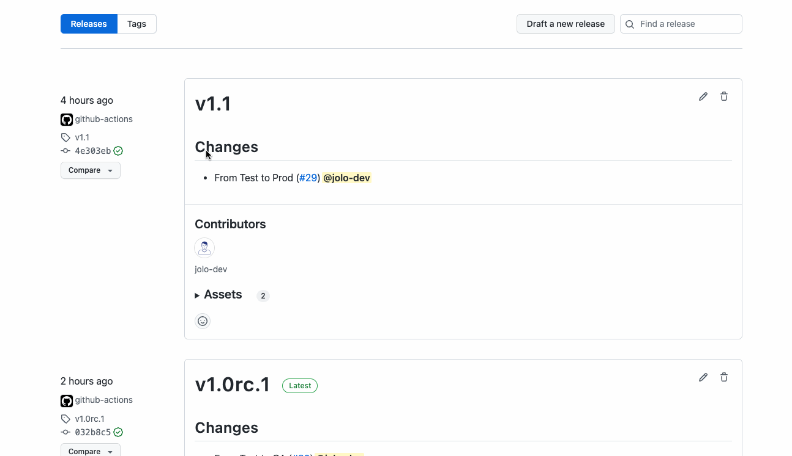
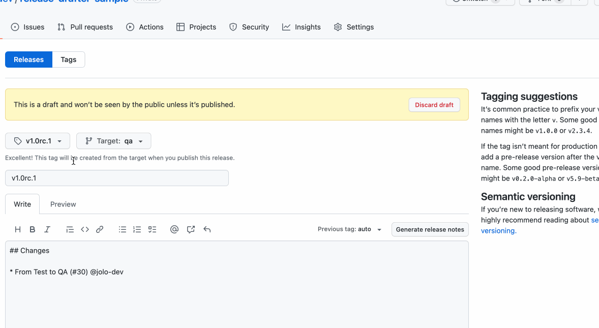
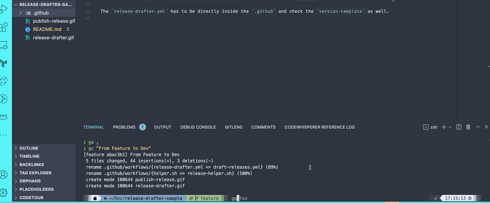

# Release Drafter Sample

## Template

The `.github/workflows/draft-releases.yml` creates Drafts of releases whenever a PR is merged and uses the [release-drafter](https://github.com/release-drafter/release-drafter). This is just a template. So it can be adjust accordingly  
In the template, this works on branch:

- `dev`
- `test`
- `qa`
- `main`

**Please, note that the release-drafter only draft releases but not published them.**

The responsible person still needs to press the `publish`- Button.

## How does it work

The Github actions get triggers whenever a PR got **merged** to the above mentioned branches.

As a first step, it checks out this repository. This is necessary because we use a helper (`.github/workflows/release-helper.sh`) otherwise the bash-script won't be accessible.

That script will be executed in the second step (`semantic_version`).
Looking inside the `release-helper.sh`, you find the same branches like in the `draft-releases.yml`. **Important: These have to be the same!!**.
According to which branch, it writes the output in the `$GITHUB_OUTPUT`. Find out more [here](https://github.blog/changelog/2022-10-11-github-actions-deprecating-save-state-and-set-output-commands/).

Finally, the workflow executes the [release-drafter](https://github.com/release-drafter/release-drafter) with some custom configuration options (here: `name` and `tag`) which appends at `$RESOLVED_VERSION` the `$GITHUB_OUTPUT` coming from the `semantic_version` step.

## `release-drafter.yml`

The `.github/release-drafter` defines basically the output of the release.
The `version-template: '$MAJOR.$MINOR'` changes the default `$RESOLVED_VERSION` with `$MAJOR.$MINOR.$PATCH`. Since we dropped the `$PATCH`, `version-resolver` also become `default: minor`.
And the `template` creates the content.

## What you need to check

Please, check the `.github/workflows/draft-releases.yml` if the branches are correct and also check if you are using the enterprise version (it requires a `GHE_HOST`).
Also check the `.github/workflows/release-helper.sh` if the branches are correct with the respective suffix. 

The `release-drafter.yml` has to be directly inside the `.github` and check the `version-template` as well.
